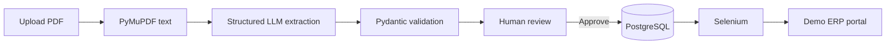

# FreightMind — AI Document & Web Process Automation

FreightMind turns shipping PDFs into validated, human-approved ERP orders. It combines local PDF extraction, structured LLM output, Pydantic validation, an explicit review gate, and Selenium automation against a deterministic demo portal.

## Business problem

Shipping teams frequently re-key customer, container, route, weight, and date information from documents into operational systems. Manual entry is slow and error-prone; blind AI submission creates a different risk. FreightMind automates the repetitive steps while preserving human accountability before any ERP write.

## Workflow



Invalid or incomplete AI output is saved for review but can never be submitted automatically. `MOCK_LLM=true` provides deterministic local extraction without an API key.

## Technology

- Python 3.12, Django 5, Django REST Framework
- PyMuPDF for digital PDF text extraction
- OpenAI-compatible chat-completions API with JSON response mode
- Pydantic v2 validation
- PostgreSQL 16
- Selenium and Chromium
- React, Vite, TypeScript, Tailwind CSS
- Docker Compose, pytest, GitHub Actions

## Run with Docker

```bash
cp .env.example .env
docker compose up --build
```

Open:

- Web app: <http://localhost:5173>
- API health: <http://localhost:8000/health/>
- Demo ERP portal: <http://localhost:8082>

Upload `sample_documents/01-valid-shipping-order.pdf`, review the fields, then select **Approve & automate**.

## Local development

Backend:

```bash
cd backend
python -m venv .venv
source .venv/bin/activate  # Windows: .venv\Scripts\activate
pip install -r requirements.txt
python manage.py migrate
python manage.py runserver
```

Frontend:

```bash
cd frontend
npm install
npm run dev
```

Serve `mock-portal/` on port 8082 for a local Selenium run. OCR is intentionally not part of the MVP; scanned PDFs return a clear extraction error.

## Configuration

| Variable | Purpose | Safe local default |
| --- | --- | --- |
| `DATABASE_URL` | PostgreSQL connection | SQLite when omitted |
| `DJANGO_SECRET_KEY` | Django signing secret | development-only fallback |
| `MOCK_LLM` | Use deterministic local extraction | `true` |
| `LLM_API_KEY` | Provider API key | empty in mock mode |
| `LLM_BASE_URL` | OpenAI-compatible base URL | `https://api.openai.com/v1` |
| `LLM_MODEL` | Model identifier | `gpt-4.1-mini` |
| `MOCK_PORTAL_URL` | Demo ERP URL for Selenium | `http://localhost:8082` |
| `CHROME_BINARY` | Optional Chromium path | Selenium discovery |
| `CHROMEDRIVER_PATH` | Optional local ChromeDriver executable | Selenium discovery |
| `VITE_API_URL` | Browser-facing API URL | `http://localhost:8000/api` |

Never commit API keys, database passwords, or production Django secrets. `.env` is excluded from Git.

## API

| Method | Endpoint | Description |
| --- | --- | --- |
| POST | `/api/documents/` | Upload a PDF (maximum 10 MB) |
| GET | `/api/documents/{id}/` | Retrieve document and processing state |
| POST | `/api/documents/{id}/extract/` | Extract text and structured data |
| GET | `/api/documents/{id}/extraction/` | Retrieve structured extraction |
| PATCH | `/api/documents/{id}/extraction/` | Save human corrections |
| POST | `/api/documents/{id}/approve/` | Validate and approve data |
| POST | `/api/documents/{id}/automate/` | Submit approved data to demo ERP |
| GET | `/api/jobs/{id}/` | Retrieve a processing job |

## Prompt strategy

The prompt defines exactly six fields, requires JSON-only output, forbids invented values, uses `null` for missing data, and specifies normalized kilograms and ISO dates. The service also requests provider-side JSON response mode. Provider output is still treated as untrusted and validated before persistence or automation.

## Validation and human review

`ShipmentExtraction` requires nonblank customer and route fields, an ISO-style container number, positive kilograms, a valid date, and different origin/destination values. Extraction always ends in `REVIEW_REQUIRED`, even when validation passes. Only the explicit approval endpoint changes the document to `APPROVED`; the automation endpoint rejects every other state.

## Selenium workflow

1. Confirm that the document is approved.
2. Create a `RUNNING` automation job.
3. Open the local ERP portal and wait for each field.
4. Populate the reviewed values and submit.
5. Wait for confirmation and extract the ERP reference.
6. Atomically save the reference and mark the document `AUTOMATED`.
7. Always close browser resources.

Normal page waiting uses `WebDriverWait`, not arbitrary sleeps.

## Tests

```bash
cd backend && pytest
cd ../frontend && npm run lint && npm run build && npm audit
```

Coverage includes PDF upload and rejection, PyMuPDF extraction, mock LLM behavior, missing/invalid values, review edits, approval, pre-approval blocking, success/failure automation, and REST retrieval.

## Sample documents

- `01-valid-shipping-order.pdf`
- `02-missing-container-number.pdf`
- `03-invalid-weight.pdf`
- `04-missing-destination.pdf`
- `05-alternate-date-format.pdf`

Regenerate them with `python scripts/generate_sample_pdfs.py`.

## Screenshots

- Dashboard — add after running the Compose stack.
- Side-by-side review screen — add with the valid sample.
- ERP success result — add after automation.

## Future improvements

- OCR for scanned documents
- Asynchronous workers and webhooks
- Provider-agnostic LLM adapters and evaluation datasets
- Per-field confidence and provenance highlights
- Authentication, audit trails, and role-based approval
- Duplicate-document detection and antivirus scanning
- Production observability and retry queues

See [docs/architecture.md](docs/architecture.md) for trust boundaries and state transitions.
