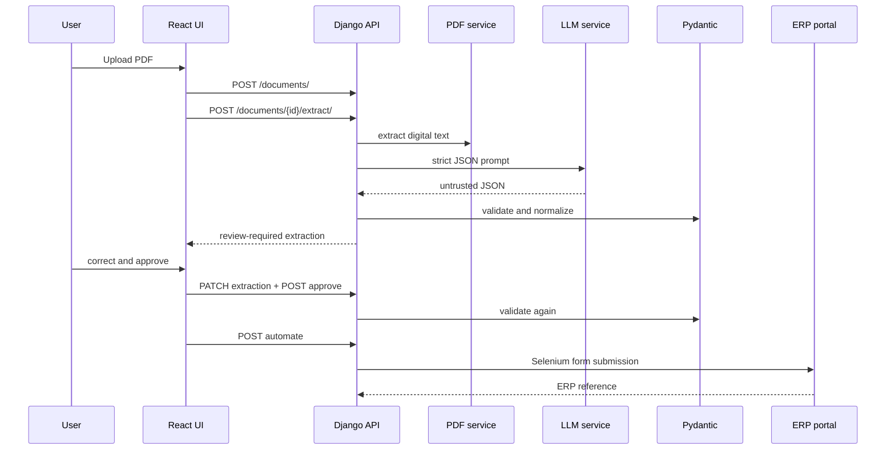
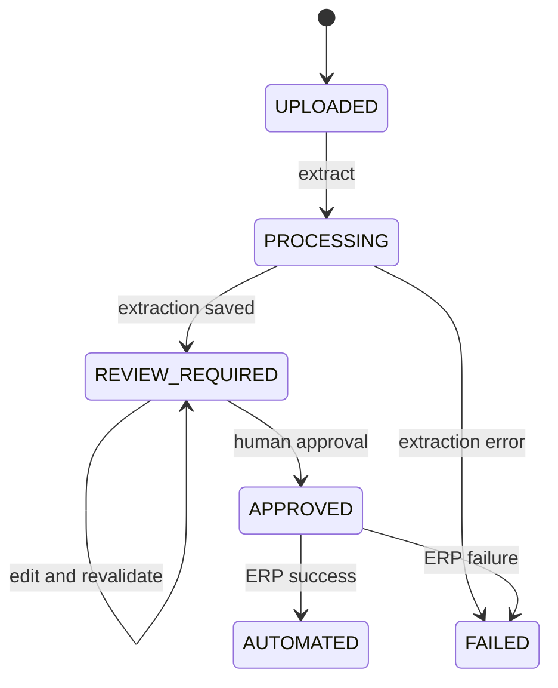

# Architecture, trust boundaries, and state machine

## Request flow

## Trust boundaries

- PDF content is untrusted. Only PDFs up to 10 MB are accepted; PyMuPDF parsing failures are explicit.
- LLM output is untrusted. JSON mode improves shape but does not replace Pydantic validation.
- A passing validation result does not imply approval. Every extraction transitions to `REVIEW_REQUIRED`.
- The ERP write endpoint checks the persisted `APPROVED` state; the frontend cannot bypass it.
- Secrets exist only in environment variables. Mock mode requires no external credential.

## Document states

## Service boundaries

- `pdf_service.py`: binary PDF → normalized text
- `llm_service.py`: strict prompt, provider call/mock mode, JSON parsing
- `validation_service.py`: domain schema and storage-safe normalization
- `document_service.py`: extraction job orchestration and state changes
- `automation_service.py`: ERP job orchestration and transaction
- `portal_client.py`: selectors, waits, form submission, and browser cleanup

The orchestration stays out of Django views, and Selenium stays out of both views and domain services.
